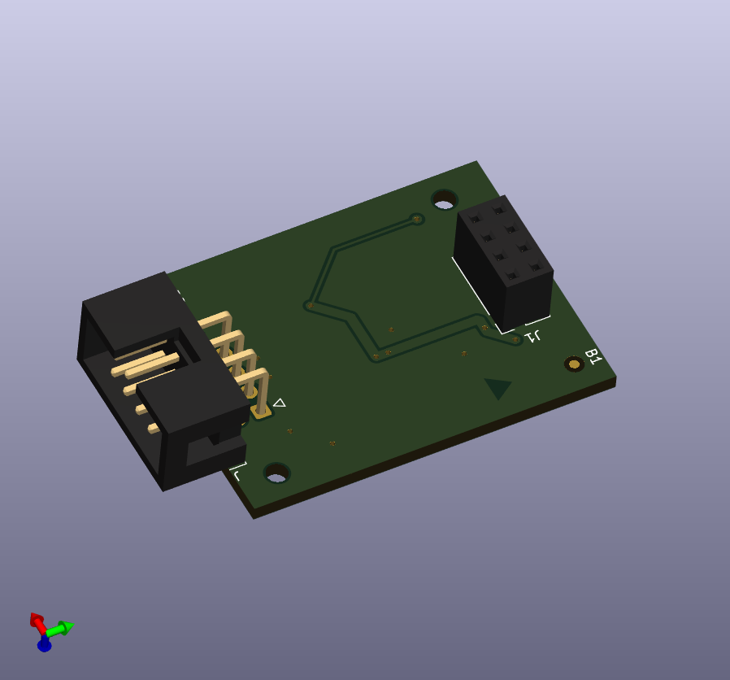
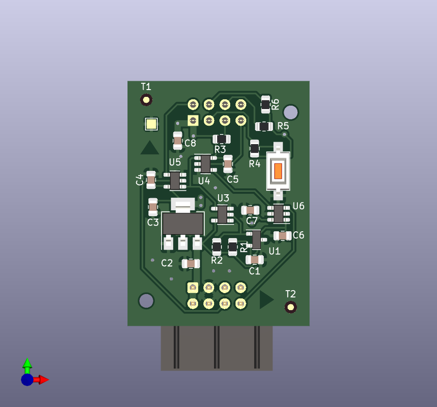

# CNCD ESP-01 Board

The motherboard for ESP-01 running CNCD firmware.

## How to use it

1. Grab the ESP-01 board and flash it with [CNCD firmware](https://github.com/wireless-cnc/cncd-esp01)
2. Insert ESP-01 into the slot, the arrow on the top side shows the direction of the ESP-01 antenna
3. Connect the board with the CNC Controller Board using [Offline Controller's cable](https://docs.sainsmart.com/article/zinzutpbhg-genmitsu-3018-pro-offline-controller-guide)
4. Power on CNC
5. Configure WiFi connection of CNCD 
6. Install and run [Wireless CNC Controller](https://github.com/wireless-cnc/cnc-controller/releases)
7. Now you can upload CNC job to controller and launch it!

## What's there

This repo contains source files developed in KiCAD 7.0:

* Board schematic
* PCB layout
* Gerber files

## Board features

* IDP connector compatible with CNC-3018 offline controllers
* Onboard 5V to 3.3V voltage regulator for powering ESP chip
* Delayed serial interface initialization
* Voltage level conversion from CNC 5V serial to ESP's 3.3V serial